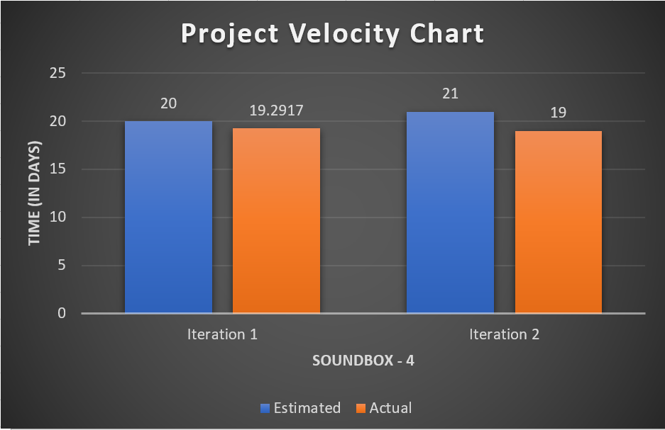

# Retrospective

Throughout this project, we've made mistakes, had successes, and learnt quite a bit from each. As a team, we held a  retrospective session after Iteration 2 and it allowed us to identify our problem and its improvement.

## Problem & solution
Our iteration 2 retrospective hit on a very important one: Spreading out work, and not doing it all in the day before the deadline. We're by no means experts at that (And our commit history would keep us honest on that one), but we've certainly improved at leaving less of it until the last moments.

Going hand-in-hand with that is the ideas of accurate/conservative time estimates, effective distribution and monitoring of workloads. After all, to plan the work accurately, the time estimates need to also be accurate or conservative, and we were rather on the mark with them (see the velocity chart for details). We obviously weren’t exact, but we were close enough that we’d consider it a success in our process.

## Concrete ways of improvement
The team environment has given us insight into, and some skills to work in, an actual workplace scenario. We’ve had to trust other people. In a large project, we can’t understand the whole development process and system, and even if you could, it would certainly not be the most efficient way. In order to meet these challenges, and furthermore to control/manage our project and team members more effectively to meet the deadline without stress, having a project manager, like real world software development, allowed us all to be as productive as we could be.

The project manager is responsible for distributing tasks according to each member's skills, monitoring of workloads and set the project schedule efficiently to improve our problem. Project manager will also
* Make data from each team member's technical skills and schedule.
* Create and manage project calendar on Slack and notify/remind each member to complete their job in time.
* Create issues on Gitlab (features, user stories and developer tasks) with accurate estimated time and schedule, then assign those tasks to the right member who is most qualified for the task according to their skills.

## Measuring the success of the improvement
The success of the improvement will be measured by completing our assigned tasks in time on Gitlab. More specifically, we can review the issues(features, user stories and developer tasks) of Iteration 3 on Gitlab and examine a velocity and push history data for Iteration 3. Success of the improvement will be evaluated measurable by comparing the Iteration 3 velocity to our current velocity chart(Iteration 1 and 2) at the end of the iteration 3 or we can also analyze our push history data and compare them with estimated time/schedule.

## Project Velocity

